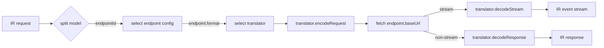

# custom-auth

[](https://www.npmjs.com/package/custom-auth)
[](https://www.npmjs.com/package/custom-auth)
[](https://github.com/intisy-ai/custom-auth/actions)

A generic [`core-auth`](https://github.com/intisy-ai/core-auth) provider for user-configured HTTP AI
endpoints. Instead of one upstream vendor, it drives any number of endpoints declared in its own
config, each with its own wire format, translating canonical IR to and from that format via
whichever vendor translators are installed. It vendors none itself: every `@intisy-ai/*-translator`
in the home's shared library store is discovered at runtime, so a translator published later is
usable without updating this plugin, and a home with none installed speaks no format yet. The API
key for each endpoint is never stored in config: it lives in core-auth's account store, reachable
only through the Accounts menu.

## Under-the-Hood Architecture



## Structure

- `src/`
  - `src/driver.ts`, the provider: resolves the endpoint + translator for a model, calls
    `handleIr()`, and declares the `endpoints` setting.
  - `src/endpoints.ts`, endpoint config lookup, model-name splitting, and the key store bridge
    (`saveKey`/`keyFor`) into core-auth's accounts.
  - `src/handler.ts`, Claude entry (exposes the IR-native `handleIr` the proxy front-door calls).
  - `src/index.ts`, OpenCode entry (`defineProvider(driver).opencode`) and the `/custom-auth-config`
    CLI guard.
  - `src/translators.ts`, discovery of the installed vendor translators (package name to wire
    format, found by shape rather than export name).
- `dist/`
  - `dist/index.js`, `dist/handler.js`, `dist/driver.js`; not committed. `@intisy-ai/core`,
    `core-auth` and `core-ir` stay external and resolve from the home's shared library store.

## Installation

### Via plugin-updater (recommended)

```bash
npx plugin-updater@latest init https://github.com/intisy-ai/custom-auth
```

### Via npm

```bash
npm install custom-auth
```

This package publishes under two names: `custom-auth` and `@intisy-ai/custom-auth`, both
resolving to the same build.

## Configuration

Config file: `<configDir>/config/custom-auth.json` (edit via the loader or `/custom-auth-config
set`).

```json
{
  "endpoints": [
    { "id": "local", "label": "Local endpoint", "baseUrl": "https://api.example.com/v1", "format": "openai", "models": ["gpt-4o"] }
  ]
}
```

| Field | Meaning |
| --- | --- |
| `id` | Short identifier used as the model prefix. |
| `label` | Display name shown in the loader. |
| `baseUrl` | The endpoint's base URL (its `/chat/completions` path is appended). |
| `format` | The wire format to translate through (currently `openai`). |
| `models` | The upstream model names this endpoint serves. |

The API key for an endpoint is never part of this file. It is stored via core-auth's account
store (`saveKey`, reachable through the Accounts menu), keyed to the endpoint's `id`, so it never
appears in a config diff or a shared config export.

## Usage

Each endpoint's models are advertised namespaced as `<endpointId>/<upstreamModel>`, for example
`local/gpt-4o`. Selecting one of these models routes the request through that endpoint's
translator; the `<endpointId>` prefix is stripped before the request reaches the upstream service.

## License

MIT.
